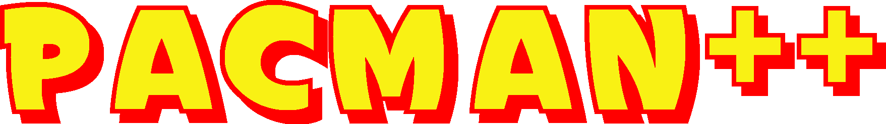

Gioco creato da Giorgio Croci, Davide Fiori, Claudio Maggioni, Pamela Dardano e Kevin Carvelli.

## Che cos'è

*Pacman++* è un *side-scroll bidimensionale* scritto in Java mediante l'uso della libreria per GUI *Swing*. Il programma è multithreaded e tutte le immagini presenti nel gioco sono originali, cioè create da zero. 

## Analisi tecnica

Il protagonista, Pacman appunto, deve schivare ostacoli fissi e fantasmi, muovendosi nelle quattro dimensioni dello spazio bidimensionale. `PacmanCharacter` è la classe singleton che gestisce l’acquisizione del cibo e i movimenti causati dalla pressione dei tasti W,A,S,D.

I fantasmi sono rappresentati da istanze della classe `Ghost`, la quale li crea e gli attribuisce velocità e direzione nel movimento casuali, rendendo il gioco il meno prevedibile possibile. Gli ostacoli sono gestiti dalla classe `Obstacle`, e i pallini/monete/punti sono oggetti di classe `Food`. 

Le ultime 3 classi estendono `Thing`, classe che implementa tre interfacce: `Movable`, `Drawable` e `Boundable`. 

Lo sfondo, diviso in orizzonti che si muovono a velocità diverse, è gestito dalla classe `Background`. 

Il gioco contiene anche una colonna sonora ispirata a `Tetris`.

## Divisione dei compiti

- **Giorgio Croci**: creatore di quasi ogni sprite e colonna sonora nonchè della logica di movimento di personaggi e sfondo;
- **Davide Fiori**: grafico creatore del logo, dei menù e di parte delle sprite e collaboratore nello sviluppo;
- **Claudio Maggioni**: programmatore in generale e ideatore della logica dietro singleton, interfacce, e la classe `Thing`;
- **Kevin Carvelli**: collaboratore nello sviluppo;
- **Pamela Dardano**: collaboratrice per la grafica.

## Installazione da sorgenti

La repository è in progetto di *Intellij IDEA* senza dipendenze. È sufficiente clonare e compilare.